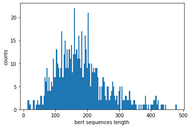
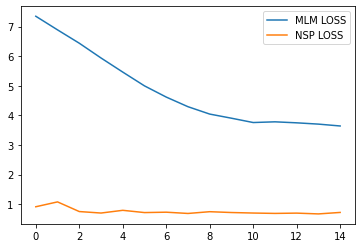

```python
import matplotlib.pyplot as plt
import re
import collections
import string
import random
import math
import torch 
import torch.nn as nn
```

***
## BERT

https://aclanthology.org/N19-1423.pdf
***

### *DATASET READING AND CLEANING*

*Frankenstein; Or, The Modern Prometheus by Mary Wollstonecraft Shelley* : https://www.gutenberg.org/ebooks/84

*The Souls of Black Folk by W. E. B. Du Bois* : https://www.gutenberg.org/ebooks/408

The two books above are concatenated

***

**Load dataset**


```python
with open("../data/bert_dataset.txt", "r") as file:
    data = file.read();
```

**Pre-tokenization cleaning**


```python
def preTknCleaning(raw_text):
    data = re.sub(r"[^a-z]", " ", raw_text.lower()).strip();
    data = re.sub(r"\s+", " ", data);   
    
    return data;
```

**Pre-tokenization leading example start** **---------------------------------------- s**


```python
example_rawtext = "I am 78 in the: montain;' I the /love..sf'";
example_rawtext = preTknCleaning(example_rawtext);
print(example_rawtext);
```

    i am in the montain i the love sf


**Pre-tokenization leading example end** **---------------------------------------- e**

***

### *WordPiece Tokenization*

https://huggingface.co/course/chapter6/6?fw=pt

***

**Token counting**


```python
def tokenCounting(raw_text_cleaned):
    data = raw_text_cleaned.split(" ");
    
    return collections.Counter(data);
```

**---------------------------------------- s**


```python
example_rawtext_counter = tokenCounting(example_rawtext);
example_rawtext_counter
```


    Counter({'i': 2, 'am': 1, 'in': 1, 'the': 2, 'montain': 1, 'love': 1, 'sf': 1})


**---------------------------------------- e**

**WordPiece Tokenization initialization**


```python
def wordPieceInitialization(data_dict):
    data_dict_init = {};
    
    for key, value in data_dict.items():
        k = re.sub(r"\s*", " ##", key).split()[:-1];
        k[0] = k[0][2:];
        k = " ".join(k);
        data_dict_init[k] = value;
        
    return data_dict_init;                
```

**---------------------------------------- s**


```python
example_data_dict_init = wordPieceInitialization(example_rawtext_counter);
example_data_dict_init
```


    {'i': 2,
     'a ##m': 1,
     'i ##n': 1,
     't ##h ##e': 2,
     'm ##o ##n ##t ##a ##i ##n': 1,
     'l ##o ##v ##e': 1,
     's ##f': 1}


**---------------------------------------- e**

**Vocabulary initialization**


```python
string.ascii_lowercase
```


    'abcdefghijklmnopqrstuvwxyz'


```python
class Vocab:
    def __init__(self):
        self.idx_to_token = ['[UNK]', '[CLS]', '[SEP]', '[MASK]', '[PAD]'];
        self.idx_to_token += re.sub(r"\s*", " ", string.ascii_lowercase).strip().split(" ");
        self.idx_to_token += re.sub(r"\s*", " ##", string.ascii_lowercase).strip().split(" ")[:-1];
        
        self.token_to_idx = {token: i for i, token in enumerate(self.idx_to_token)};
        
    def addToVocabulary(self, token):
        self.idx_to_token.append(token);
        self.token_to_idx[token] = len(self.idx_to_token) - 1;
        
    def getIdx(self, token):
        return self.token_to_idx[token];
    
    def getToken(self, idx):
        return self.idx_to_token[idx];
```

**WordPiece tokenization**


```python
def wordPieceMachinery(data_dict, vocab, max_vocab_size):
    
    while(len(vocab.idx_to_token) < max_vocab_size):
        
        pairs_dict = collections.defaultdict(int);
        tokens_dict = collections.defaultdict(int);

        for key, value in data_dict.items():
            key_splitted = key.split(" ");

            if len(key_splitted) > 1:
                for i in range(len(key_splitted)-1):
                    pair = (key_splitted[i], key_splitted[i+1]);
                    pairs_dict[pair] += value;
                    tokens_dict[key_splitted[i]] += value;
                tokens_dict[key_splitted[i+1]] += value;

            else:
                tokens_dict[key_splitted[0]] += value;

        for key, value in pairs_dict.items():
            divisor = tokens_dict[key[0]]*tokens_dict[key[1]];
            pairs_dict[key] = value/divisor;
            
        if len(pairs_dict) == 0:
            break;

        pair_to_merge = max(pairs_dict, key=pairs_dict.get);
        data_dict = mergePairAndUpdateVocab(data_dict, vocab, pair_to_merge);
```


```python
def mergePairAndUpdateVocab(data_dict, vocab, pair_to_merge):
    new_data_dict = {};
    
    if pair_to_merge[0][0] != "#":
        pair_merged = pair_to_merge[0] + pair_to_merge[1][2:];
    else:
        pair_merged = "##" + pair_to_merge[0][2:] + pair_to_merge[1][2:];
        
    vocab.addToVocabulary(pair_merged);
    
    for key, value in data_dict.items():
        key_splitted = key.split(" ");
        len_key_splitted = len(key_splitted);
        
        if len_key_splitted > 1:
            i = 0;
            while(i < len_key_splitted-1):

                if (key_splitted[i], key_splitted[i+1])== pair_to_merge:
                                        
                    key_splitted[i] = pair_merged;
                    del key_splitted[i+1];
                    len_key_splitted -= 1;
                    
                i += 1;
                                    
        new_key = " ".join(key_splitted);
        new_data_dict[new_key] = value;
        
    return new_data_dict;
```

**---------------------------------------- s**


```python
example_vocabulary = Vocab();
wordPieceMachinery(example_data_dict_init, example_vocabulary, 60);
print("Example vocabulary => ", example_vocabulary.idx_to_token)
```

    Example vocabulary =>  ['[UNK]', '[CLS]', '[SEP]', '[MASK]', '[PAD]', 'a', 'b', 'c', 'd', 'e', 'f', 'g', 'h', 'i', 'j', 'k', 'l', 'm', 'n', 'o', 'p', 'q', 'r', 's', 't', 'u', 'v', 'w', 'x', 'y', 'z', '##a', '##b', '##c', '##d', '##e', '##f', '##g', '##h', '##i', '##j', '##k', '##l', '##m', '##n', '##o', '##p', '##q', '##r', '##s', '##t', '##u', '##v', '##w', '##x', '##y', '##z', 'am', '##ta', '##tai']


```python
len(example_vocabulary.idx_to_token)
```


    60


**---------------------------------------- e**

**Encode word given WordPiece Tokenization vocabulary**


```python
def encode(word, vocab):
    
    subwords = [];
    
    start, end = 0, len(word);
    while(start < end):
        if start == 0:
            subword = word[start:end];
        else:
            subword = "##" + word[start:end];

        if subword in vocab.idx_to_token:
            subwords.append(vocab.token_to_idx[subword]);
            start = end;
            end = len(word);
        else:
            end -= 1;
            
    if start < len(word):
        subwords = [vocab.token_to_idx['[UNK]']];  
    
    return subwords;
```

**---------------------------------------- s**


```python
example_subwords = [encode(word, example_vocabulary) for word in example_rawtext.split(" ")];

print([example_vocabulary.idx_to_token[idx] for tkn in example_subwords for idx in tkn])
```

    ['i', 'am', 'i', '##n', 't', '##h', '##e', 'm', '##o', '##n', '##tai', '##n', 'i', 't', '##h', '##e', 'l', '##o', '##v', '##e', 's', '##f']


**---------------------------------------- e**

**Apply WordPiece Tokenization on dataset**


```python
def wordPieceTokenization(raw_text, max_vocab_size):
    
    vocabulary = Vocab();
    
    cleaned_raw_text = preTknCleaning(raw_text);
    data_counter = tokenCounting(cleaned_raw_text);
    data_dict_init = wordPieceInitialization(data_counter);
    wordPieceMachinery(data_dict_init, vocabulary, max_vocab_size);
    
    sentences = [preTknCleaning(sentence) for sentence in raw_text.split('.') if len(sentence.strip()) > 0];
    
    tokenized_sentences = [];
    for sentence in sentences:
        
        tokenized_sentence = [];
        for word in sentence.split(" "):
            tokenized_sentence += encode(word, vocabulary);
        
        tokenized_sentences.append(tokenized_sentence);
        
    return tokenized_sentences, vocabulary;
```


```python
## Subsample data and end on a complete sentence
len(data),data[99997:100179]
```


    (817196,
     'd in\nour family, learned the duties of a servant, a condition which, in our\nfortunate country, does not include the idea of ignorance and a\nsacrifice of the dignity of a human being.')


```python
max_vocab_size = 1500;

tokenized_sentences, vocabulary = wordPieceTokenization(data[0:100179], max_vocab_size);
```


```python
print("VOCABULARY SIZE : ", len(vocabulary.token_to_idx));
```

    VOCABULARY SIZE :  1500


***
### *HELPER FUNCTIONS FOR PRE-TRAINING TASKS* 
***


```python
def getTokensANDSegments(cls_idx, sep_idx, tokens_a, tokens_b=None):
    tokens = [cls_idx] + tokens_a + [sep_idx];
    
    # 0 and 1 are marking segment A and B, respectively
    segments = [0] * (len(tokens_a) + 2);
    if tokens_b is not None:
        tokens += tokens_b + [sep_idx];
        segments += [1] * (len(tokens_b) + 1);
    return tokens, segments;
```

**NEXT SENTENCE PREDICTION**


```python
def getNextSentence(sentence, next_sentence, sentences):
    if random.random() <= 0.5:
        is_next = True;
    else:
        next_sentence = random.choice(sentences);
        is_next = False;
    return sentence, next_sentence, is_next;
```


```python
def getNSPDataFromSentences(sentences, vocab):
    cls_idx, sep_idx = vocab.token_to_idx['[CLS]'], vocab.token_to_idx['[SEP]'];
    
    nsp_data_from_sentences = [];
    for i in range(len(sentences) - 1):
        tokens_a, tokens_b, is_next = getNextSentence(
            sentences[i], sentences[i + 1], sentences);
            
        bert_sequence, segments = getTokensANDSegments(cls_idx, sep_idx, tokens_a, tokens_b);
        nsp_data_from_sentences.append((bert_sequence, segments, is_next));
    return nsp_data_from_sentences;
```

**BERT SEQUENCES STATISTICS**


```python
_get_NSP_data_from_sentences = getNSPDataFromSentences(tokenized_sentences, vocabulary);
```


```python
print("NUMBER OF BERT SEQUENCES: ", len(_get_NSP_data_from_sentences));
```

    NUMBER OF BERT SEQUENCES:  686


```python
_bert_seq_len = [len(bert_seq[0]) for bert_seq in _get_NSP_data_from_sentences];
_seq_unique_len = set(_bert_seq_len);

plt.hist(_bert_seq_len, bins=int(len(_seq_unique_len)/2));
plt.xlabel("bert sequences length");
plt.ylabel("counts");
```


    

    


```python
print("NUMBER OF BERT SEQUENCES WITH 75 <= LENGTH <= 175 :", 
      len(list(filter(lambda l: l >= 75 and l <= 175, _bert_seq_len))));
```

    NUMBER OF BERT SEQUENCES WITH 75 <= LENGTH <= 175 : 315


**HYPERPARAMETERS**

The above statistics help us to choose the following two hyperparameters:
- max_len
- min_len


```python
min_len = 75;
max_len = 175;
```

**MASKED MODELING TASK**


```python
def maskBERTSequence(bert_sequence, vocab):
    cls_idx, sep_idx = vocab.token_to_idx['[CLS]'], vocab.token_to_idx['[SEP]'];
    
    mask_idx = vocab.token_to_idx['[MASK]'];
    masked_bert_sequence = bert_sequence[:];
    masked_indices = [];
    masked_tokens = [];
    
    len_vocab = len(vocab.idx_to_token);
    
    for i in range(len(bert_sequence)):
        if i == cls_idx or i == sep_idx:
            continue;
        else:
            if random.random() <= 0.15:
                if random.random() <= 0.8:
                    masked_bert_sequence[i] = mask_idx;
                else:
                    if random.random() <= 0.5:
                        # 5 is the number of special tokens = ["[UNK]", "[CLS]", "[SEP]", "[MASK]", "[PAD]"]
                        # And we don't want to replace with one of them
                        masked_bert_sequence[i] = random.randint(5, len_vocab-1);
                    else:
                        masked_bert_sequence[i] = bert_sequence[i];
                
                masked_indices.append(i);
                masked_tokens.append(bert_sequence[i]);
        
    return (masked_bert_sequence, masked_indices, masked_tokens);
```

**PADDING**


```python
def padding(examples, min_len, max_len, vocab):
    
    unk_idx, pad_idx = vocab.token_to_idx['[UNK]'], vocab.token_to_idx['[PAD]'];
    
    masked_bert_sequences, segments = [],[];
    masked_indices, masked_tokens = [],[];
    nsp_labels, valid_len = [],[];
    
    max_num_preds = 0;
    for _,masked_ids,_,_,_ in examples: 
        max_num_preds = max(max_num_preds, len(masked_ids));
    
    for masked_bert_sequence, masked_ids, masked_tks, segment, is_next in examples:
        if len(masked_bert_sequence) < min_len or len(masked_bert_sequence) > max_len:
            continue;
            
        masked_bert_sequences.append(masked_bert_sequence + [pad_idx]*(max_len - len(masked_bert_sequence)));
        segments.append(segment + [0]*(max_len - len(segment)));
        valid_len.append(len(masked_bert_sequence));
        
        ## We can pad masked_indices with 0 because by construction 
        ## the index 0 cannot be masked. (see maskBERTSequence condition)
        masked_indices.append(masked_ids + [0] * (max_num_preds - len(masked_ids)));
        
        ## We can pad masked_tokens with the index of the token ['UNK']
        masked_tokens.append(masked_tks + [unk_idx] * (max_num_preds - len(masked_tks)));
        
        nsp_labels.append(is_next);

    return (torch.tensor(masked_bert_sequences), torch.tensor(segments), 
            torch.tensor(masked_indices), torch.tensor(masked_tokens),
            torch.tensor(nsp_labels, dtype=torch.long), torch.tensor(valid_len));
```

***
### *DATASET LOADING*
***


```python
class Dataset(torch.utils.data.Dataset):
    def __init__(self, tokenized_sentences, min_len, max_len, vocab):
        
        _nsp_data_from_sentences = getNSPDataFromSentences(tokenized_sentences, vocab);
        
        examples = [(maskBERTSequence(bert_sequence, vocab) + (segment, is_next))
                    for bert_sequence, segment, is_next in _nsp_data_from_sentences];
        
        
        (self.masked_bert_sequences, self.segments, 
         self.masked_indices, self.masked_tokens, 
         self.nsp_labels, self.valid_len) = padding(examples, min_len, max_len, vocab);
        
    def __getitem__(self, idx):
        return (self.masked_bert_sequences[idx], self.segments[idx], 
                self.masked_indices[idx], self.masked_tokens[idx], 
                self.nsp_labels[idx], self.valid_len[idx]);
    
    def __len__(self):
        return len(self.masked_bert_sequences);
```


```python
dataset = Dataset(tokenized_sentences, min_len, max_len, vocabulary);
training_set_loader = torch.utils.data.DataLoader(dataset, batch_size=128, shuffle=True);
```

**AN EXAMPLAR OF ONE TRAINING EXAMPLE**


```python
print("masked bert sequence : ", dataset[0][0], '\n');
print("segments : ", dataset[0][1], '\n');
print("masked indices : ", dataset[0][2], '\n');
print("masked tokens : ", dataset[0][3], '\n');
print("nsp label : ", dataset[0][4], '\n');
print("valid length : ", dataset[0][5],'\n');
```

    masked bert sequence :  tensor([   1,  102,   35,   49,   35,    5,   48,   35,   73,  996,   39,    3,
              35,    3,   35,    3,   50,    3,    5,   44,   34,  102,   35,    3,
               5,   48,   35,    3,   35,   44,   50,  136,  228,   35,   48,    3,
              42,    3,   10,   35,   31,   48,   66,  898,   35,   48, 1105,    8,
               3,    3,    3,    5,   44,   34,    3,   13,   44,   34,   51,   33,
              35,   17,    3,  136,  217,   35,   44,   33,    3,  102,   39,    3,
            1403,   26,   45,   55,   31,   37,   35, 1028,    3,   35,   95,    5,
            1332,   10,   35,   35,   42,    3,  130,   35,   44,   12,   35,  273,
              49,   13,   44,    5, 1201,   35,    6,   45,   31,    3,    3,   12,
              39,   49,   12,   45,   42,  178,   34,  476,   55,   17,   31,   50,
              35,    3, 1083,    5,   44,   61,   35,   34,   39,   50,   39,   45,
              44,   66,    8,    3,   49,    3,   45,   52,   35,   48,   55,   70,
              12,   39,   49,   18,   31,    3,   39,   52,   35,   22,   39,   52,
              35,   48,    2,  749,  102,    2,    4,    4,    4,    4,    4,    4,
               4,    4,    4,    4,    4,    4,    4]) 
    
    segments :  tensor([0, 0, 0, 0, 0, 0, 0, 0, 0, 0, 0, 0, 0, 0, 0, 0, 0, 0, 0, 0, 0, 0, 0, 0,
            0, 0, 0, 0, 0, 0, 0, 0, 0, 0, 0, 0, 0, 0, 0, 0, 0, 0, 0, 0, 0, 0, 0, 0,
            0, 0, 0, 0, 0, 0, 0, 0, 0, 0, 0, 0, 0, 0, 0, 0, 0, 0, 0, 0, 0, 0, 0, 0,
            0, 0, 0, 0, 0, 0, 0, 0, 0, 0, 0, 0, 0, 0, 0, 0, 0, 0, 0, 0, 0, 0, 0, 0,
            0, 0, 0, 0, 0, 0, 0, 0, 0, 0, 0, 0, 0, 0, 0, 0, 0, 0, 0, 0, 0, 0, 0, 0,
            0, 0, 0, 0, 0, 0, 0, 0, 0, 0, 0, 0, 0, 0, 0, 0, 0, 0, 0, 0, 0, 0, 0, 0,
            0, 0, 0, 0, 0, 0, 0, 0, 0, 0, 0, 0, 0, 0, 0, 1, 1, 1, 0, 0, 0, 0, 0, 0,
            0, 0, 0, 0, 0, 0, 0]) 
    
    masked indices :  tensor([  7,  11,  13,  15,  17,  23,  27,  35,  37,  48,  49,  50,  54,  62,
             68,  71,  80,  89,  97, 100, 104, 105, 106, 113, 115, 121, 135, 137,
            149,   0,   0,   0,   0,   0,   0,   0,   0,   0,   0,   0,   0,   0,
              0,   0,   0,   0,   0,   0,   0,   0,   0,   0,   0,   0,   0,   0,
              0,   0,   0,   0,   0,   0,   0,   0,   0,   0,   0,   0,   0,   0,
              0,   0,   0,   0,   0,   0,   0,   0,   0,   0,   0,   0,   0,   0]) 
    
    masked tokens :  tensor([  35,   33,   43,   44,   49,   55,  448,    5,   42,   35,   31,  349,
             136,   35,   35,   49,  102,   49,   13, 1318,   31,   50, 1028,   39,
              31,   49,   39,   33,   50,    0,    0,    0,    0,    0,    0,    0,
               0,    0,    0,    0,    0,    0,    0,    0,    0,    0,    0,    0,
               0,    0,    0,    0,    0,    0,    0,    0,    0,    0,    0,    0,
               0,    0,    0,    0,    0,    0,    0,    0,    0,    0,    0,    0,
               0,    0,    0,    0,    0,    0,    0,    0,    0,    0,    0,    0]) 
    
    nsp label :  tensor(0) 
    
    valid length :  tensor(162) 
    


***
### *PRE-TRAINING TASKS*
***

**MASKED LANGUAGE MODELLING**


```python
class MLM(nn.Module):
    def __init__(self, vocab_size, dmodel):
        super().__init__();
        self.mlp = nn.Sequential(nn.LazyLinear(dmodel),
                                 nn.ReLU(),
                                 nn.LayerNorm(dmodel),
                                 nn.LazyLinear(vocab_size));
        
    def forward(self, X, masked_indices):
        seq_max_len = len(X[0]);
        masked_indices = nn.functional.one_hot(masked_indices, seq_max_len).type(dtype=torch.float32);
        mlm_Y_hat = self.mlp(torch.bmm(masked_indices, X));
        
        return mlm_Y_hat;
```

**NEXT SENTENCE PREDICTION**


```python
class NextSentencePred(nn.Module):
    def __init__(self):
        super().__init__();
        self.output = nn.LazyLinear(2);

    def forward(self, X):
        # X shape: (batch size, dmodel)
        return self.output(X);
```

***
### *MODEL ARCHITECTURE* 
***

**ATTENTION**


```python
class MultiHeadAttention(nn.Module):
    def __init__(self, num_heads, dk, dv, dmodel):
        super().__init__();
        
        self.num_heads = num_heads;
        self.dk = dk;
        
        self.weights_params = [];
        for i in range(num_heads):
            WQi = nn.Linear(dmodel,dk);
            WKi = nn.Linear(dmodel,dk);
            WVi = nn.Linear(dmodel,dv);
            
            self.weights_params.append([WQi,WKi,WVi]);
            
        self.WO = nn.Linear(num_heads*dv,dmodel);
    
    def forward(self, queries, keys, values, valid_len=None):
        # (queries|keys|values).shape = (batch_size, num_steps, dmodel)
        
        heads = [];
        
        for i in range(self.num_heads):
            WQi, WKi, WVi = self.weights_params[i];
            
            # ith head shape = (batch_size, num_steps, dv)
            heads.append(
                scaledDotProductAttention(WQi(queries), WKi(keys), WVi(values), self.dk, valid_len));
        
        # heads.shape = (batch_size, num_steps, num_heads*dv)
        heads = torch.cat(heads, dim=-1);
        
        return self.WO(heads);
```


```python
def scaledDotProductAttention(Q, K, V, dk, valid_len):
    QK = torch.bmm(Q,K.transpose(1,2)) / math.sqrt(dk);
    
    return torch.bmm(maskedSoftmax(QK, valid_len), V);
```


```python
def maskedSoftmax(QK, valid_len):
    # QK.shape = (batch_size, num_steps, num_steps)
    
    QK_shape = QK.shape;
    
    if valid_len is not None:
        steps = torch.arange(1, QK_shape[1]+1).unsqueeze(dim=0).repeat(QK_shape[1],1).unsqueeze(dim=0).repeat(QK_shape[0], 1, 1);
        valid_len = valid_len.unsqueeze(dim=1).unsqueeze(dim=1).repeat_interleave(repeats=QK_shape[1], dim=1);
        padding_mask = steps > valid_len;
        
        QK[padding_mask] = -1e6;
    
    return nn.functional.softmax(QK, dim=-1);
```

**POSITION-WISE FEED FORWARD NETWORKS**


```python
class FFN(nn.Module):
    def __init__(self, dmodel, dff):
        super().__init__();
        
        self.W1 = nn.Linear(dmodel,dff);
        self.W2 = nn.Linear(dff,dmodel);
        self.relu = nn.ReLU();
        
    def forward(self, X):
        # X.shape = (batch_size, num_steps, dmodel)
        
        return self.W2(self.relu(self.W1(X)));
```

**RESIDUALS**


```python
class AddandNorm(nn.Module):
    def __init__(self, dmodel, dropout=0):
        super().__init__();
        
        self.LN = nn.LayerNorm(dmodel);
        self.dropout = nn.Dropout(dropout);
    
    def forward(self, X, Y):
        # (X|Y).shape = (batch_size, num_steps, dmodel)

        return self.LN(X + self.dropout(Y));
```

**POSITIONAL ENCODING**


```python
class PositionalEncoding(nn.Module):
    def __init__(self, dmodel, dropout, max_seq_len=1000):
        super().__init__();
        
        # It is possible that dmodel is odd but this makes the code more complex without adding value.
        assert dmodel % 2 == 0, "dmodel must be even";
        
        self.dropout = nn.Dropout();
        
        # t.shape = (max_seq_len, dmodel/2)
        t = torch.arange(0,max_seq_len).unsqueeze(dim=1).repeat_interleave(repeats=int(dmodel/2),dim=1);
        # w.shape = (max_seq_len, dmodel/2)
        wk = 1/torch.pow(10000, torch.arange(0,dmodel,step=2)/dmodel).unsqueeze(dim=0);
        wk = wk.repeat_interleave(repeats=max_seq_len,dim=0);
        
        # pos_encoding.shape = (max_seq_len, dmodel)
        self.pos_encoding = torch.zeros(max_seq_len, dmodel);
        self.pos_encoding[:,0::2] = torch.sin(wk*t);
        self.pos_encoding[:,1::2] = torch.cos(wk*t);

    def forward(self, X):
        # X.shape = (batch_size, num_steps, dmodel)
        X_shape = X.shape;
        
        pos_encoding = self.pos_encoding[:X_shape[1],:].unsqueeze(dim=0).repeat(X.shape[0],1,1);
        
        return self.dropout(pos_encoding + X);
```

**BERT ENCODER**


```python
class EncoderBlock(nn.Module):
    def __init__(self, num_heads, dmodel, dk, dv, dff, dropout):
        super().__init__();
        
        self.MHA = MultiHeadAttention(num_heads, dk, dv, dmodel);
        self.AAN = AddandNorm(dmodel, dropout);
        self.FFN = FFN(dmodel, dff);

    def forward(self, X, valid_len):
        # sli_out.shape = (batch_size, number of steps in src_X, dmodel)
        # sli stands for the ith sublayer of the encoder block.
        
        sl1_out = self.MHA(X, X, X, valid_len);
        sl1_out = self.AAN(X, sl1_out);
        
        sl2_out = self.FFN(sl1_out)
        sl2_out = self.AAN(sl1_out, sl2_out);
        
        return sl2_out;
```


```python
class BERTEncoder(nn.Module):
    def __init__(self, num_blocks, vocab_size, num_heads, dmodel, dk, dv, dff, dropout, max_seq_len):
        super().__init__();
        
        self.num_blocks = num_blocks;
        self.embedding = nn.Embedding(vocab_size, dmodel);
        self.pencoding = PositionalEncoding(dmodel, dropout, max_seq_len);
        self.segment_embedding = nn.Embedding(2, dmodel);
        
        self.encoder_blocks = [];
        for i in range(num_blocks):
            self.encoder_blocks.append(EncoderBlock(num_heads, dmodel, dk, dv, dff, dropout));

    def forward(self, bert_sequences, segments, valid_len):
        # X.shape = (batch_size, number of steps in src_X, dmodel)
        X = self.pencoding(self.embedding(bert_sequences)) + self.segment_embedding(segments);
            
        for i in range(self.num_blocks):
            X = self.encoder_blocks[i](X, valid_len);
            
        return X;
```

***
### *BERT MODEL*
***


```python
class BERTModel(nn.Module):
    def __init__(self, num_blocks, vocab_size, num_heads, dmodel, dk, dv, dff, dropout, max_seq_len=1000):
        super().__init__();
        self.bert_encoder = BERTEncoder(num_blocks, vocab_size, num_heads, dmodel, dk, dv, dff, dropout, max_seq_len);
        self.mlm = MLM(vocab_size, dmodel);
        self.nsp = NextSentencePred();
        self.hidden_layer = nn.Sequential(nn.LazyLinear(dmodel), nn.ReLU(), nn.LayerNorm(dmodel));  
        
    def forward(self, bert_sequences, segments, valid_len, masked_indices):
        encoded_X = self.bert_encoder(bert_sequences, segments, valid_len);
        mlm_Y_hat = self.mlm(encoded_X, masked_indices);
        nsp_Y_hat = self.nsp(self.hidden_layer(encoded_X[:,0,:]));
        
        return encoded_X, mlm_Y_hat, nsp_Y_hat;
```

***
### *BERT PRE-TRAINING*
***

**NET**


```python
num_blocks=2;
vocab_size=len(vocabulary.token_to_idx); 
num_heads = 3;
dmodel, dk, dv, dff = 32, 16, 16, 32;
dropout = 0.1;

net = BERTModel(num_blocks, vocab_size, num_heads, dmodel, dk, dv, dff, dropout);
loss = nn.CrossEntropyLoss();
```

    /home/excelsior/anaconda3/envs/d2l/lib/python3.8/site-packages/torch/nn/modules/lazy.py:178: UserWarning: Lazy modules are a new feature under heavy development so changes to the API or functionality can happen at any moment.
      warnings.warn('Lazy modules are a new feature under heavy development '


**LOSS**


```python
def getBatchLossBERT(net, loss, vocab_size, unk_idx, 
                     bert_sequences, segments, valid_len, masked_indices, mlm_Y, nsp_Y):
    
    _, mlm_Y_hat, nsp_Y_hat = net(bert_sequences, segments, valid_len, masked_indices);
    
    ## MLM LOSS
    mlm_Y_hat = mlm_Y_hat.reshape(-1, vocab_size)[mlm_Y.flatten() != unk_idx];
    mlm_Y = mlm_Y[mlm_Y != unk_idx];
    mlm_loss = loss(mlm_Y_hat, mlm_Y);
    
    ## NSP LOSS
    nsp_loss = loss(nsp_Y_hat, nsp_Y);
    
    ## TOTAL LOSS
    total_loss = mlm_loss + nsp_loss;
    
    return total_loss, mlm_loss, nsp_loss;
```

**OPTIMIZER**


```python
optimizer = torch.optim.Adam(net.parameters(), lr=0.01);
```

**TRAINING BERT**


```python
def training(training_set_loader, net, loss, optimizer, vocab, num_epochs):
    unk_idx, vocab_size = vocab.token_to_idx['[UNK]'], len(vocab.token_to_idx);
    
    mlm_losses, nsp_losses = [],[];
    
    for _ in range(num_epochs):
        for masked_bert_sequence, segment, masked_indices, masked_tokens, nsp_label, valid_len in training_set_loader:
            
            total_loss, mlm_loss, nsp_loss = getBatchLossBERT(net, loss, vocab_size, unk_idx, masked_bert_sequence,
                                                segment, valid_len, masked_indices, masked_tokens, nsp_label);
            
            total_loss.backward();
            optimizer.step();
            optimizer.zero_grad();
            
            mlm_losses.append(mlm_loss);
            nsp_losses.append(nsp_loss);
        
    return mlm_losses, nsp_losses;
```


```python
mlm_losses, nsp_losses = training(training_set_loader, net, loss, optimizer, vocabulary, 5);
```


```python
plt.plot(torch.arange(0, len(mlm_losses)), [l.detach().numpy() for l in mlm_losses]);
plt.plot(torch.arange(0, len(nsp_losses)), [l.detach().numpy() for l in nsp_losses]);
plt.legend(["MLM LOSS", "NSP LOSS"]);
```


    

    


```python
## Due to a small training set and a small number of iterations (due to limited computing power)
## the mean training loss for the nsp task is no better than random guessing. -ln(0.5) = 0.6931.

torch.mean(torch.tensor(nsp_losses))
```


    tensor(0.7537)


