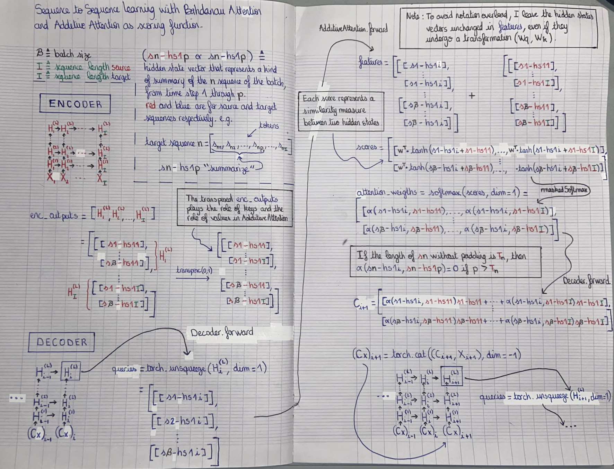

```python
import torch
import torch.nn as nn
import numpy as np
import collections
import copy
```

***
### ENCODER-DECODER IMPLEMENTATION FROM SCRATCH ON THE MACHINE TRANSLATION PROBLEM
### WITH *BADHANAU ATTENTION* AND *ADDITIVE ATTENTION SCORING FUNCTION*
***

### *DATA*

Source : http://www.manythings.org/anki/

In the file **"en_fra.txt"** each line is an example and can be broken down as follows:

ENGLISH_PART \t FRENCH_PART \t REFERENCES_PART


```python
with open("../data/en_fra.txt") as f:
    examples = f.readlines();
```


```python
examples[0]
```


    'Go.\tVa !\tCC-BY 2.0 (France) Attribution: tatoeba.org #2877272 (CM) & #1158250 (Wittydev)\n'


```python
def standardizeString(string, is_string_target):

    space_characters = ['\u202f', '\u2009','\xa0'];
    special_characters = '«»"-.,;:!?';
    numbers = '0123456789';
    
    ## Remove space characters
    for i in range(len(space_characters)):
        if space_characters[i] in string:
            string = string.replace(space_characters[i], ' ');
        
    len_string, _string = len(string), '';
    for i, char in enumerate(string):
        
        ## Handle special characters
        if char in special_characters:
            left_space, right_space = '', '';
            
            if i > 0 and string[i-1] != ' ':
                left_space = ' ';

            if i+1 < len_string and string[i+1] != ' ' and string[i+1] not in special_characters:
                right_space = ' ';
            
            _string += left_space + char + right_space;

        ## Handle hours
        elif char == 'h':
            left_space, right_space = '', '';
            
            if i > 0 and string[i-1] in numbers:
                left_space = ' ';
            
            if i+1 < len_string and string[i+1] in numbers:
                right_space = ' ';
                
            _string += left_space + char + right_space;         
                
        else:
            _string += char;

    
    _string = _string.lower() + ' <eos>';
    
    return '<bos> ' + _string if is_string_target else _string;
```


```python
en_examples, fr_examples = [], [];

for i in range(len(examples)):
    exi = examples[i][0:examples[i].find('CC-BY 2.0')];

    exi = exi.split('\t');

    en_examples.append(standardizeString(exi[0], False).split(' '));
    fr_examples.append(standardizeString(exi[1], True).split(' '));
```


```python
print(examples[87620][0:examples[87620].find('CC-BY 2.0')]);
print('--------');
print('EN => ',en_examples[87620]);
print('FR => ',fr_examples[87620]);
```

    I've got a meeting at 2:30.	J'ai une réunion à 2h30.	
    --------
    EN =>  ["i've", 'got', 'a', 'meeting', 'at', '2', ':', '30', '.', '<eos>']
    FR =>  ['<bos>', "j'ai", 'une', 'réunion', 'à', '2', 'h', '30', '.', '<eos>']


```python
print(examples[91613][0:examples[91613].find('CC-BY 2.0')]);
print('--------');
print('EN => ',en_examples[91613]);
print('FR => ',fr_examples[91613]);
```

    "More coffee?" "No, thanks."	«Davantage de café ?» «Non, c'est bon.»	
    --------
    EN =>  ['"', 'more', 'coffee', '?', '"', '"', 'no', ',', 'thanks', '.', '"', '<eos>']
    FR =>  ['<bos>', '«', 'davantage', 'de', 'café', '?', '»', '«', 'non', ',', "c'est", 'bon', '.', '»', '<eos>']


***
### *VOCAB*


```python
class Vocab:
    def __init__(self, dataset2d):
        self.token_to_idx = {};
        self.idx_to_token = [];
        self.initVocab(dataset2d);
        
    def initVocab(self, dataset2d):
        token_freq = collections.Counter(
            [dataset2d[i][j] for i in range(len(dataset2d)) for j in range(len(dataset2d[i]))]);
        token_freq = token_freq.most_common();
        
        for i in range(len(token_freq)):
            self.token_to_idx[token_freq[i][0]] = i;
            self.idx_to_token.append(token_freq[i][0]);
    
    def tokenToIdx(self, dataset2d):
        for i in range(len(dataset2d)):
            for j in range(len(dataset2d[i])):
                dataset2d[i][j] = self.token_to_idx[dataset2d[i][j]];
        return torch.tensor(dataset2d);
                
    def idxToToken(self, dataset2d):
        dataset2d = dataset2d.tolist();
        
        for i in range(len(dataset2d)):
            for j in range(len(dataset2d[i])):
                dataset2d[i][j] = self.idx_to_token[dataset2d[i][j]];
        return dataset2d;
    
    def __len__(self):
        return len(self.idx_to_token);
```

***
### *DATASETS TRAIN/TEST AND THEIR RESPECTIVE VOCABULARY*


```python
def datasets(source_examples, target_examples, dataset_train_size, dataset_test_size, 
             batch_size_train, batch_size_test):
    
    source_examples = copy.deepcopy(source_examples);
    target_examples = copy.deepcopy(target_examples);
    
    ## The document "en_fra.txt" provides examples in ascending order of the number of tokens.
    ## So before delineating my training/test datasets, randomize the order of the examples,
    ## in order to maximize the heterogeneity in both.
    random_indexation = torch.randperm(dataset_train_size + dataset_test_size);
    
    source_examples = source_examples[0:dataset_train_size+dataset_test_size];
    source_examples = [source_examples[random_indexation[i]] for i in range(len(random_indexation))];
    target_examples = target_examples[0:dataset_train_size+dataset_test_size];
    target_examples = [target_examples[random_indexation[i]] for i in range(len(random_indexation))];
    
    ## source_seq_len[i] = the number of tokens of sequence i (before padding).
    ## The importance of these quantities lies in the calculation of the context variable C in the encoder.
    source_seq_len = sequencesLen(source_examples);
    source_seq_len_train = source_seq_len[0:dataset_train_size];
    source_seq_len_test = source_seq_len[dataset_train_size:dataset_train_size+dataset_test_size];
    
    source_examples = padding(source_examples);
    target_examples = padding(target_examples);

    source_vocab = Vocab(source_examples);
    source_examples = source_vocab.tokenToIdx(source_examples);
    target_vocab = Vocab(target_examples);
    target_examples = target_vocab.tokenToIdx(target_examples);

    ds_src_train = source_examples[0:dataset_train_size];
    ds_trg_train_in = target_examples[0:dataset_train_size][:,:-1];
    ds_trg_train_out = target_examples[0:dataset_train_size][:,1:];
    datasets_train = dataLoader(batch_size_train, True, ds_src_train, source_seq_len_train, 
                                ds_trg_train_in, ds_trg_train_out); 
    
    ds_src_test = source_examples[dataset_train_size:dataset_train_size+dataset_test_size];
    ds_trg_test_out = target_examples[dataset_train_size:dataset_train_size+dataset_test_size][:,1:];
    datasets_test = dataLoader(batch_size_test, False, ds_src_test, source_seq_len_test, ds_trg_test_out);
    
    return datasets_train, datasets_test, source_vocab, target_vocab;
```


```python
def dataLoader(batch_size, shuffle, *tensors):
    TD = torch.utils.data.TensorDataset(*tensors);
    return torch.utils.data.DataLoader(TD, batch_size, shuffle);
```


```python
## Determine the longest sequence among dataset_examples 
## and complete the other sequences with the <pad> token so that their length matches the longest.

def padding(dataset_examples):
    
    max_length = 0;

    def maxLength(dataset, max_length):
        for i in range(len(dataset)):
            if len(dataset[i]) > max_length:
                max_length = len(dataset[i]);
        return max_length;
                
    max_length = maxLength(dataset_examples, max_length);
    
    def pad(dataset, max_length):
        for i in range(len(dataset)):
            if len(dataset[i]) < max_length:
                dataset[i] += ['<pad>']*(max_length-len(dataset[i]));
        return dataset;
    
    dataset_examples = pad(dataset_examples, max_length);
                
    return dataset_examples;
```


```python
def sequencesLen(dataset_examples):
    
    sequences_len = [];
    
    for i in range(len(dataset_examples)):
        sequences_len.append(len(dataset_examples[i]));
        
    return torch.tensor(sequences_len);
```


```python
dataset_train_size = 750;
dataset_test_size = 50;
batch_size_train = 750;
batch_size_test = 10;

datasets_train, datasets_test, source_vocab, target_vocab = datasets(en_examples, 
                                                                     fr_examples, 
                                                                     dataset_train_size, 
                                                                     dataset_test_size, 
                                                                     batch_size_train, 
                                                                     batch_size_test);
```


```python
len(source_vocab), len(target_vocab)
```


    (249, 578)


***
### *ATTENTION*

Here is a verbal summary of what I tried to say in pictures below:

**DECODER**

At each time step i in the decoder, the output of the decoder is a matrix (the hidden states (I use the plural because we are proceeding in batches) of time i of the last layer L) that can be seen as a set of rows so that each row is associated with the sequence that is on the same row in the batch. 

Each of the rows of this matrix is a vector that is a kind of encoded summary (technically called "hidden state") of the respective sequence from token 1 to token i.

**ENCODER**

The output of the encoder consists of the hidden states for each time step of the last layer of the RNN.

The same decomposition and analysis as in **DECODER** follows for each hidden state at different time steps.
  

**ATTENTION BAHDANAU**

Now, the idea behind Bahdanau attention is an interaction (the interaction is determined by the choice of the scoring function) between the different rows of hidden states at time step i of the decoder with the rows lying at the same position of the different hidden states of the encoder (its output).

More precisely, the first row of hidden states of the time step i of the decoder will interact with:
- The first row of the first hidden states of the encoder.
- The first row of the second hidden states of the encoder.
- The first row of the third hidden states of the encoder.
- etc...

And identically for the other rows of the hidden states of the time step i of the decoder.

**ATTENTION POOLING**

Each interaction between two rows has for objective to give a similarity measure between these two rows. 

The objective is to take a linear combination of the different rows at a given position so that a row counts in this linear combination proportionally to its similarity with the row of the decoder.

The final objective is to concatenate these different linear combinations with the input of the decoder at time step i+1 (always respecting the positioning of each row) so that the decoder has a more accurate context, which can consequently produce more accurate predictions.  



```python
## Example of scores_to_modify calculation in maskedSoftmax.

torch.arange(1,5).repeat(4,1) > torch.tensor([4,2,1,2]).unsqueeze(dim=1)
```


    tensor([[False, False, False, False],
            [False, False,  True,  True],
            [False,  True,  True,  True],
            [False, False,  True,  True]])


```python
def maskedSoftmax(scores, source_seq_len):
    ## scores.shape = (batch_size, seq_length)
    ## source_seq_len.shape = (batch_size)

    scores_to_modify = torch.arange(1,len(scores[0])+1).repeat(len(source_seq_len),1);
    scores_to_modify = scores_to_modify > source_seq_len.unsqueeze(dim=1);
    
    ## Some scores are linked to the <pad> token, 
    ## and so that their attention weights are not considered, 
    ## giving them a low score (like -1e6) will give them an attention weight 
    ## of 0 after applying softmax. 
    scores[scores_to_modify] = -1e6;
    
    return nn.functional.softmax(scores, dim=1);
```


```python
class AdditiveAttention(nn.Module):
    def __init__(self, aa_hidden_size):
        super().__init__();
        
        self.W_q = nn.LazyLinear(aa_hidden_size);
        self.W_k = nn.LazyLinear(aa_hidden_size);
        self.w = nn.LazyLinear(1, bias=False);
        
    def forward(self, queries, keys, source_seq_len):
        ## queries.shape = (batch_size, 1, aa_hidden_size)
        ## keys.shape = (batch_size, seq_length, aa_hidden_size)
        queries, keys = self.W_q(queries), self.W_k(keys);
        
        ## features.shape = (batch_size, seq_length, aa_hidden_size)
        features = queries + keys;
        
        ## scores.shape = (batch_size, seq_length)
        scores = self.w(features).squeeze(dim=-1);
        
        ## attention_weights.shape = (batch_size, seq_length)
        attention_weights = maskedSoftmax(scores, source_seq_len);
        
        return attention_weights;
```

***
### *ENCODER-DECODER MODEL*


```python
class Encoder(nn.Module):
    def __init__(self, input_size, hidden_size, num_layers, vocab_size):
        super().__init__();
        self.lstm = nn.LSTM(input_size, hidden_size, num_layers);
        self.embedding = nn.Embedding(vocab_size, input_size);
        
        self.parametersWeightsDim(input_size, hidden_size);
        
    def parametersWeightsDim(self, input_size, hidden_size):
        print("----ENCODER WEIGHTS PARAMATERS----");
        print("(Wii|Wif|Wig|Wio) dimensions : ", (input_size, hidden_size));
        print("(Whi|Whf|Whg|Who) dimensions : ", (hidden_size, hidden_size));
        print("----------------------------------");

    def forward(self, src_X):
        src_X = self.embedding(src_X.t());
        H, hc = self.lstm(src_X);
        
        return H, hc;
```


```python
class Decoder(nn.Module):
    def __init__(self, input_size, hidden_size, aa_hidden_size, num_layers, vocab_size):
        super().__init__();
        
        self.hidden_size = hidden_size;
                
        self.lstm = nn.LSTM(input_size+hidden_size, hidden_size, num_layers);
        self.embedding = nn.Embedding(vocab_size, input_size);
        self.fc = nn.LazyLinear(vocab_size);
        self.additiveAttention = AdditiveAttention(aa_hidden_size);
        
        self.parametersWeightsDim(input_size+hidden_size, hidden_size);
        
        
    def parametersWeightsDim(self, input_size, hidden_size):
        print("----DECODER WEIGHTS PARAMATERS----");
        print("(Wii|Wif|Wig|Wio) dimensions : ", (input_size, hidden_size));
        print("(Whi|Whf|Whg|Who) dimensions : ", (hidden_size, hidden_size));
        print("----------------------------------");
        
        
    def contextVariable(self, attention_weights, values):
        ## attention_weights.shape = (batch_size, seq_length)
        ## values.shape = (batch_size, seq_length, hidden_size)
        
        ## attention_weights.shape = (batch_size, 1, seq_length)
        attention_weights = attention_weights.unsqueeze(dim=1);
        
        return torch.squeeze(torch.bmm(attention_weights, values), dim=1);
            

    def forward(self, bos_X, enc_outputs, enc_hc, source_seq_len):
        
        outputs = [];
        
        ## enc_outputs.shape = (batch_size, seq_length, hidden_size)
        enc_outputs = torch.transpose(enc_outputs,0,1);
        
        ## bos_X.shape = (seq_length, batch_size, input_size)
        bos_X = self.embedding(bos_X.t());
        
        for i, x in enumerate(bos_X):
            ## x.shape = (1, batch_size, input_size) 
            x = torch.unsqueeze(x,dim=0);
            
            if i == 0:
                ## C.shape = (1, batch_size, hidden_size)
                C = torch.zeros(x.size(0), x.size(1), self.hidden_size);
                
                ## Cx.shape = (1, batch_size, hidden_size + input_size)
                Cx = torch.cat((C, x), dim=-1);           
                
                ## H.shape = (1, batch_size, hidden_size)
                H, hc = self.lstm(Cx, enc_hc);
                
                outputs.append(H); 
            else:
                ## queries.shape = (batch_size, 1, hidden_size)
                queries = torch.unsqueeze(H[0], dim=1);
                
                ## attention_weights.shape = (batch_size, seq_length)
                attention_weights = self.additiveAttention(queries, enc_outputs, source_seq_len); 
                
                ## C.shape = (batch_size, hidden_size)
                C = self.contextVariable(attention_weights, enc_outputs);
                ## C.shape = (1, batch_size, hidden_size)
                C = C.unsqueeze(dim=0);
                
                ## Cx.shape = (1, batch_size, hidden_size + input_size)
                Cx = torch.cat((C, x), dim=-1);
                
                ## H.shape = (1, batch_size, hidden_size)
                H, hc = self.lstm(Cx, hc);
                
                outputs.append(H);

        outputs = torch.cat(outputs,dim=0);
        outputs = torch.transpose(outputs,0,1);
        
        return self.fc(outputs);
```


```python
class EncoderDecoder(nn.Module):
    def __init__(self, encoder, decoder):
        super().__init__();
        self.encoder = encoder;
        self.decoder = decoder;
        
    def forward(self, src_X, bos_X, source_seq_len):
        
        H, hc = self.encoder(src_X);
        Y_hat = self.decoder(bos_X, H, hc, source_seq_len);
        
        return Y_hat;
```


```python
input_size = 16;
hidden_size = 16;
aa_hidden_size = 8;
num_layers = 1;
source_vocab_size = len(source_vocab);
target_vocab_size = len(target_vocab);

encoder = Encoder(input_size, hidden_size, num_layers, source_vocab_size);
decoder = Decoder(input_size, hidden_size, aa_hidden_size, num_layers, target_vocab_size);
model = EncoderDecoder(encoder, decoder);
```

    ----ENCODER WEIGHTS PARAMATERS----
    (Wii|Wif|Wig|Wio) dimensions :  (16, 16)
    (Whi|Whf|Whg|Who) dimensions :  (16, 16)
    ----------------------------------
    ----DECODER WEIGHTS PARAMATERS----
    (Wii|Wif|Wig|Wio) dimensions :  (32, 16)
    (Whi|Whf|Whg|Who) dimensions :  (16, 16)
    ----------------------------------


    /home/excelsior/anaconda3/envs/d2l/lib/python3.8/site-packages/torch/nn/modules/lazy.py:178: UserWarning: Lazy modules are a new feature under heavy development so changes to the API or functionality can happen at any moment.
      warnings.warn('Lazy modules are a new feature under heavy development '


```python
def loadModel(model, load_model=False):
    if load_model:
        model.load_state_dict(torch.load('../data/lstm_parameters_BahdanauAttention_ch11.pt'));
```


```python
loadModel(model, False);
```

***
### *LOSS*


```python
pad_idx = target_vocab.token_to_idx['<pad>'];
pad_idx
```


    0


```python
CEL = nn.CrossEntropyLoss();
```


```python
def loss(Y_hat, Y, pad_idx):

    Y_hat = Y_hat.reshape(-1, Y_hat.shape[-1]);
    Y = Y.flatten();
    
    is_not_pad = Y != pad_idx;
    
    Y_hat = Y_hat[is_not_pad];
    Y = Y[is_not_pad];

    return CEL(Y_hat, Y);
```

***
### *OPTIMIZER*


```python
# optimizer = torch.optim.Adam(model.parameters(), lr=0.03);
```

***
### *TRAINING*


```python
def train(model,datasets,loss,optimizer,num_epochs,save_params=False):
    
    model.train();
    for epoch in range(num_epochs):
        for src_X, source_seq_len_train, bos_X, Y in datasets:
            
            l = loss(model(src_X, bos_X, source_seq_len_train), Y, pad_idx);

            with torch.no_grad():
                l.backward();
                optimizer.step();
                optimizer.zero_grad();
        
        print(f'Epoch {epoch} - Training loss {l}');
    
    if save_params:
        torch.save(model.state_dict(), '../data/lstm_parameters_BahdanauAttention_ch11.pt');
```


```python
for i in range(3):
    optimizer = torch.optim.Adam(model.parameters(), lr=0.1/10**i);
    train(model, datasets_train, loss, optimizer, 1000*(i+1), True);
```

    Epoch 0 - Training loss 6.383927345275879
    Epoch 1 - Training loss 6.000179767608643
    Epoch 2 - Training loss 5.1103620529174805
    Epoch 3 - Training loss 4.297947883605957
    Epoch 4 - Training loss 3.8324947357177734
    Epoch 5 - Training loss 3.6152150630950928
    Epoch 6 - Training loss 3.404268980026245
    Epoch 7 - Training loss 3.191026210784912
    Epoch 8 - Training loss 3.0465292930603027
    ...
    Epoch 2991 - Training loss 0.52483731508255
    Epoch 2992 - Training loss 0.5248217582702637
    Epoch 2993 - Training loss 0.5248066782951355
    Epoch 2994 - Training loss 0.5247946977615356
    Epoch 2995 - Training loss 0.5247849822044373
    Epoch 2996 - Training loss 0.524774968624115
    Epoch 2997 - Training loss 0.5247634649276733
    Epoch 2998 - Training loss 0.5247502326965332
    Epoch 2999 - Training loss 0.5247368812561035


***
### *PREDICTION*


```python
bos_idx = target_vocab.token_to_idx['<bos>'];
bos_idx
```


    1


```python
eos_idx = target_vocab.token_to_idx['<eos>'];
eos_idx
```


    2


```python
def prediction(model,datasets,bos_idx,eos_idx,source_vocab,target_vocab):
    
    preds_outputs_src = [];
    preds_outputs_y = [];
    
    src_X, source_seq_len_test, Y = next(iter(datasets_test));    
    bos_X = torch.empty((len(src_X),1)).fill_(bos_idx).type(torch.int32);
    
    while(len(src_X) > 0):

        Y_hat = torch.transpose(model(src_X, bos_X, source_seq_len_test),0,1)[-1];
        preds = torch.argmax(Y_hat,dim=-1,keepdim=True);

        bos_X = torch.cat((bos_X,preds),dim=-1);

        ## Halt prediction if <eos> token.
        preds_is_eos = (preds == eos_idx).flatten();

        src_X_halt = source_vocab.idxToToken(src_X[preds_is_eos]);
        for i in range(len(src_X_halt)):
            preds_outputs_src.append(src_X_halt[i]);

        bos_X_halt = target_vocab.idxToToken(bos_X[preds_is_eos]);
        for i in range(len(bos_X_halt)):
            preds_outputs_y.append(bos_X_halt[i]);

        ## Delete terminated predictions.
        src_X = src_X[~preds_is_eos];
        bos_X = bos_X[~preds_is_eos];
        source_seq_len_test = source_seq_len_test[~preds_is_eos];
         
    return preds_outputs_src, preds_outputs_y;
```


```python
out_src, out_y = prediction(model,datasets_test,bos_idx,eos_idx, source_vocab, target_vocab);
```


```python
for x, y in zip(out_src, out_y):
    print("src => ", x);
    print("pred => ", y);
    print("******");
```

    src =>  ['go', 'away', '!', '<eos>', '<pad>']
    pred =>  ['<bos>', 'pars', '!', '<eos>']
    ******
    src =>  ['run', '.', '<eos>', '<pad>', '<pad>']
    pred =>  ['<bos>', 'cours', '!', '<eos>']
    ******
    src =>  ['i', 'use', 'it', '.', '<eos>']
    pred =>  ['<bos>', 'je', "l'utilise", '.', '<eos>']
    ******
    src =>  ["i'm", 'lost', '.', '<eos>', '<pad>']
    pred =>  ['<bos>', 'je', 'suis', 'paumé', '.', '<eos>']
    ******
    src =>  ["i'm", 'sure', '.', '<eos>', '<pad>']
    pred =>  ['<bos>', "j'en", 'suis', 'sûre', '.', '<eos>']
    ******
    src =>  ['hurry', 'up', '.', '<eos>', '<pad>']
    pred =>  ['<bos>', 'asseyez', '-', 'vous', '!', '<eos>']
    ******
    src =>  ["i'm", 'sad', '.', '<eos>', '<pad>']
    pred =>  ['<bos>', "j'ai", 'un', 'coup', 'de', 'cafard', '.', '<eos>']
    ******
    src =>  ['relax', '.', '<eos>', '<pad>', '<pad>']
    pred =>  ['<bos>', 'prenez', 'vos', 'jambes', 'à', 'vos', 'cous', '!', '<eos>']
    ******
    src =>  ['say', 'what', '?', '<eos>', '<pad>']
    pred =>  ['<bos>', 'sois', 'gentil', 'ferme', 'ferme', 'ferme', '-', 'en', '!', '<eos>']
    ******
    src =>  ['kick', 'it', '.', '<eos>', '<pad>']
    pred =>  ['<bos>', 'inscris', 'on', 'suis', 'joli', 'moi', 'suis', 'tenue', 'debout', '.', '<eos>']
    ******

