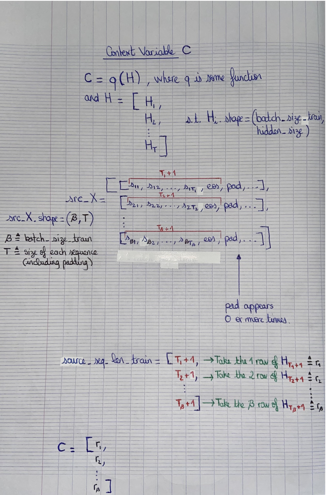

```python
import torch
import torch.nn as nn
import numpy as np
import collections
import copy
```

***
### ENCODER-DECODER IMPLEMENTATION FROM SCRATCH ON THE MACHINE TRANSLATION PROBLEM
***

### *DATA*

Source : http://www.manythings.org/anki/

In the file **"en_fra.txt"** each line is an example and can be broken down as follows:

ENGLISH_PART \t FRENCH_PART \t REFERENCES_PART


```python
with open("../data/en_fra.txt") as f:
    examples = f.readlines();
```


```python
examples[0]
```


    'Go.\tVa !\tCC-BY 2.0 (France) Attribution: tatoeba.org #2877272 (CM) & #1158250 (Wittydev)\n'


```python
def standardizeString(string, is_string_target):

    space_characters = ['\u202f', '\u2009','\xa0'];
    special_characters = '«»"-.,;:!?';
    numbers = '0123456789';
    
    ## Remove space characters
    for i in range(len(space_characters)):
        if space_characters[i] in string:
            string = string.replace(space_characters[i], ' ');
        
    len_string, _string = len(string), '';
    for i, char in enumerate(string):
        
        ## Handle special characters
        if char in special_characters:
            left_space, right_space = '', '';
            
            if i > 0 and string[i-1] != ' ':
                left_space = ' ';

            if i+1 < len_string and string[i+1] != ' ' and string[i+1] not in special_characters:
                right_space = ' ';
            
            _string += left_space + char + right_space;

        ## Handle hours
        elif char == 'h':
            left_space, right_space = '', '';
            
            if i > 0 and string[i-1] in numbers:
                left_space = ' ';
            
            if i+1 < len_string and string[i+1] in numbers:
                right_space = ' ';
                
            _string += left_space + char + right_space;         
                
        else:
            _string += char;

    
    _string = _string.lower() + ' <eos>';
    
    return '<bos> ' + _string if is_string_target else _string;
```


```python
en_examples, fr_examples = [], [];

for i in range(len(examples)):
    exi = examples[i][0:examples[i].find('CC-BY 2.0')];

    exi = exi.split('\t');

    en_examples.append(standardizeString(exi[0], False).split(' '));
    fr_examples.append(standardizeString(exi[1], True).split(' '));
```


```python
print(examples[87620][0:examples[87620].find('CC-BY 2.0')]);
print('--------');
print('EN => ',en_examples[87620]);
print('FR => ',fr_examples[87620]);
```

    I've got a meeting at 2:30.	J'ai une réunion à 2h30.	
    --------
    EN =>  ["i've", 'got', 'a', 'meeting', 'at', '2', ':', '30', '.', '<eos>']
    FR =>  ['<bos>', "j'ai", 'une', 'réunion', 'à', '2', 'h', '30', '.', '<eos>']


```python
print(examples[91613][0:examples[91613].find('CC-BY 2.0')]);
print('--------');
print('EN => ',en_examples[91613]);
print('FR => ',fr_examples[91613]);
```

    "More coffee?" "No, thanks."	«Davantage de café ?» «Non, c'est bon.»	
    --------
    EN =>  ['"', 'more', 'coffee', '?', '"', '"', 'no', ',', 'thanks', '.', '"', '<eos>']
    FR =>  ['<bos>', '«', 'davantage', 'de', 'café', '?', '»', '«', 'non', ',', "c'est", 'bon', '.', '»', '<eos>']


***
### VOCAB


```python
class Vocab:
    def __init__(self, dataset2d):
        self.token_to_idx = {};
        self.idx_to_token = [];
        self.initVocab(dataset2d);
        
    def initVocab(self, dataset2d):
        token_freq = collections.Counter(
            [dataset2d[i][j] for i in range(len(dataset2d)) for j in range(len(dataset2d[i]))]);
        token_freq = token_freq.most_common();
        
        for i in range(len(token_freq)):
            self.token_to_idx[token_freq[i][0]] = i;
            self.idx_to_token.append(token_freq[i][0]);
    
    def tokenToIdx(self, dataset2d):
        for i in range(len(dataset2d)):
            for j in range(len(dataset2d[i])):
                dataset2d[i][j] = self.token_to_idx[dataset2d[i][j]];
        return torch.tensor(dataset2d);
                
    def idxToToken(self, dataset2d):
        dataset2d = dataset2d.tolist();
        
        for i in range(len(dataset2d)):
            for j in range(len(dataset2d[i])):
                dataset2d[i][j] = self.idx_to_token[dataset2d[i][j]];
        return dataset2d;
    
    def __len__(self):
        return len(self.idx_to_token);
```

***
### *DATASETS TRAIN/TEST AND THEIR RESPECTIVE VOCABULARY*


```python
def datasets(source_examples, target_examples, dataset_train_size, dataset_test_size, 
             batch_size_train, batch_size_test):
    
    source_examples = copy.deepcopy(source_examples);
    target_examples = copy.deepcopy(target_examples);
    
    ## The document "en_fra.txt" provides examples in ascending order of the number of tokens.
    ## So before delineating my training/test datasets, randomize the order of the examples,
    ## in order to maximize the heterogeneity in both.
    random_indexation = torch.randperm(dataset_train_size + dataset_test_size);
    
    source_examples = source_examples[0:dataset_train_size+dataset_test_size];
    source_examples = [source_examples[random_indexation[i]] for i in range(len(random_indexation))];
    target_examples = target_examples[0:dataset_train_size+dataset_test_size];
    target_examples = [target_examples[random_indexation[i]] for i in range(len(random_indexation))];
    
    ## source_seq_len[i] = the number of tokens of sequence i (before padding).
    ## The importance of these quantities lies in the calculation of the context variable C in the encoder.
    source_seq_len = sequencesLen(source_examples);
    source_seq_len_train = source_seq_len[0:dataset_train_size];
    source_seq_len_test = source_seq_len[dataset_train_size:dataset_train_size+dataset_test_size];
    
    source_examples = padding(source_examples);
    target_examples = padding(target_examples);

    source_vocab = Vocab(source_examples);
    source_examples = source_vocab.tokenToIdx(source_examples);
    target_vocab = Vocab(target_examples);
    target_examples = target_vocab.tokenToIdx(target_examples);

    ds_src_train = source_examples[0:dataset_train_size];
    ds_trg_train_in = target_examples[0:dataset_train_size][:,:-1];
    ds_trg_train_out = target_examples[0:dataset_train_size][:,1:];
    datasets_train = dataLoader(batch_size_train, True, ds_src_train, source_seq_len_train, 
                                ds_trg_train_in, ds_trg_train_out); 
    
    ds_src_test = source_examples[dataset_train_size:dataset_train_size+dataset_test_size];
    ds_trg_test_out = target_examples[dataset_train_size:dataset_train_size+dataset_test_size][:,1:];
    datasets_test = dataLoader(batch_size_test, False, ds_src_test, source_seq_len_test, ds_trg_test_out);
    
    return datasets_train, datasets_test, source_vocab, target_vocab;
```


```python
def dataLoader(batch_size, shuffle, *tensors):
    TD = torch.utils.data.TensorDataset(*tensors);
    return torch.utils.data.DataLoader(TD, batch_size, shuffle);
```


```python
## Determine the longest sequence among dataset_examples 
## and complete the other sequences with the <pad> token so that their length matches the longest.

def padding(dataset_examples):
    
    max_length = 0;

    def maxLength(dataset, max_length):
        for i in range(len(dataset)):
            if len(dataset[i]) > max_length:
                max_length = len(dataset[i]);
        return max_length;
                
    max_length = maxLength(dataset_examples, max_length);
    
    def pad(dataset, max_length):
        for i in range(len(dataset)):
            if len(dataset[i]) < max_length:
                dataset[i] += ['<pad>']*(max_length-len(dataset[i]));
        return dataset;
    
    dataset_examples = pad(dataset_examples, max_length);
                
    return dataset_examples;
```


```python
def sequencesLen(dataset_examples):
    
    sequences_len = [];
    
    for i in range(len(dataset_examples)):
        sequences_len.append(len(dataset_examples[i]));
        
    return torch.tensor(sequences_len);
```


```python
dataset_train_size = 750;
dataset_test_size = 50;
batch_size_train = 750;
batch_size_test = 10;

datasets_train, datasets_test, source_vocab, target_vocab = datasets(en_examples, 
                                                                     fr_examples, 
                                                                     dataset_train_size, 
                                                                     dataset_test_size, 
                                                                     batch_size_train, 
                                                                     batch_size_test);
```


```python
len(source_vocab), len(target_vocab)
```


    (249, 578)


***
### ENCODER-DECODER MODEL



```python
class Encoder(nn.Module):
    def __init__(self, input_size, hidden_size, num_layers, vocab_size):
        super().__init__();
        self.lstm = nn.LSTM(input_size, hidden_size, num_layers);
        self.embedding = nn.Embedding(vocab_size, input_size);
        
        self.parametersWeightsDim(input_size, hidden_size);
        
        
    def parametersWeightsDim(self, input_size, hidden_size):
        print("----ENCODER WEIGHTS PARAMATERS----");
        print("(Wii|Wif|Wig|Wio) dimensions : ", (input_size, hidden_size));
        print("(Whi|Whf|Whg|Who) dimensions : ", (hidden_size, hidden_size));
        print("----------------------------------");
    
    def contextVariable(self, H, source_seq_len):
        
        C = torch.empty_like(H[0]);
        
        for i in range(len(source_seq_len)):
            C[i] = H[source_seq_len[i]-1][i];

        return C;
        
    def forward(self, src_X):
        src_X = self.embedding(src_X.t());
        H, hc = self.lstm(src_X);
        
        return H, hc;
```


```python
class Decoder(nn.Module):
    def __init__(self, input_size, hidden_size, num_layers, vocab_size):
        super().__init__();
        
        self.lstm = nn.LSTM(input_size+hidden_size, hidden_size, num_layers);
        self.embedding = nn.Embedding(vocab_size, input_size);
        self.fc = nn.LazyLinear(vocab_size);
        
        self.parametersWeightsDim(input_size+hidden_size, hidden_size);
        
    def parametersWeightsDim(self, input_size, hidden_size):
        print("----DECODER WEIGHTS PARAMATERS----");
        print("(Wii|Wif|Wig|Wio) dimensions : ", (input_size, hidden_size));
        print("(Whi|Whf|Whg|Who) dimensions : ", (hidden_size, hidden_size));
        print("----------------------------------");
        
    def forward(self, bos_X, C):
        bos_X = self.embedding(bos_X.t());
        C = C.repeat(len(bos_X),1,1);
        bos_X_cat_C = torch.cat((bos_X, C), dim=-1);
        
        H, hc = self.lstm(bos_X_cat_C);
        
        H = torch.transpose(H,0,1);
        
        return self.fc(H);        
```


```python
class EncoderDecoder(nn.Module):
    def __init__(self, encoder, decoder):
        super().__init__();
        self.encoder = encoder;
        self.decoder = decoder;
        
    def forward(self, src_X, bos_X, source_seq_len):
        
        H, hc = self.encoder(src_X);
        Y_hat = self.decoder(bos_X, self.encoder.contextVariable(H, source_seq_len));
        
        return Y_hat;
```


```python
input_size = 16;
hidden_size = 16;
num_layers = 1;
source_vocab_size = len(source_vocab);
target_vocab_size = len(target_vocab);

encoder = Encoder(input_size, hidden_size, num_layers, source_vocab_size);
decoder = Decoder(input_size, hidden_size, num_layers, target_vocab_size);
model = EncoderDecoder(encoder, decoder);
```

    ----ENCODER WEIGHTS PARAMATERS----
    (Wii|Wif|Wig|Wio) dimensions :  (16, 16)
    (Whi|Whf|Whg|Who) dimensions :  (16, 16)
    ----------------------------------
    ----DECODER WEIGHTS PARAMATERS----
    (Wii|Wif|Wig|Wio) dimensions :  (32, 16)
    (Whi|Whf|Whg|Who) dimensions :  (16, 16)
    ----------------------------------


    /home/excelsior/anaconda3/envs/d2l/lib/python3.8/site-packages/torch/nn/modules/lazy.py:178: UserWarning: Lazy modules are a new feature under heavy development so changes to the API or functionality can happen at any moment.
      warnings.warn('Lazy modules are a new feature under heavy development '


```python
def loadModel(model, load_model=False):
    if load_model:
        model.load_state_dict(torch.load('../data/lstm_parameters_machineTr_ch10.pt'));
```


```python
loadModel(model, False);
```

***
### *LOSS*


```python
pad_idx = target_vocab.token_to_idx['<pad>'];
pad_idx
```


    0


```python
CEL = nn.CrossEntropyLoss();
```


```python
def loss(Y_hat, Y, pad_idx):
    Y_hat = Y_hat.reshape(-1, Y_hat.shape[-1]);
    Y = Y.flatten();
    
    is_not_pad = Y != pad_idx;
    
    Y_hat = Y_hat[is_not_pad];
    Y = Y[is_not_pad];

    return CEL(Y_hat, Y);
```

***
### *OPTIMIZER*


```python
optimizer = torch.optim.Adam(model.parameters(), lr=0.003);
```

***
### *TRAINING*


```python
def train(model,datasets,loss,optimizer,num_epochs,save_params=False):
    
    model.train();
    for epoch in range(num_epochs):
        for src_X, source_seq_len_train, bos_X, Y in datasets:
            
            l = loss(model(src_X, bos_X, source_seq_len_train), Y, pad_idx);

            with torch.no_grad():
                l.backward();
                optimizer.step();
                optimizer.zero_grad();
        
        print(f'Epoch {epoch} - Training loss {l}');
    
    if save_params:
        torch.save(model.state_dict(), '../data/lstm_parameters_machineTr_ch10.pt');
```


```python
train(model, datasets_train, loss, optimizer, 1, True);
```

    Epoch 0 - Training loss 0.8236297965049744


***
### *PREDICTION*


```python
bos_idx = target_vocab.token_to_idx['<bos>'];
bos_idx
```


    1


```python
eos_idx = target_vocab.token_to_idx['<eos>'];
eos_idx
```


    2


```python
def prediction(model,datasets,bos_idx,eos_idx,source_vocab,target_vocab):
    
    preds_outputs_src = [];
    preds_outputs_y = [];
    
    src_X, source_seq_len_test, Y = next(iter(datasets_test));    
    bos_X = torch.empty((len(src_X),1)).fill_(bos_idx).type(torch.int32);
    
    while(len(src_X) > 0):

        Y_hat = torch.transpose(model(src_X, bos_X, source_seq_len_test),0,1)[-1];
        preds = torch.argmax(Y_hat,dim=-1,keepdim=True);

        bos_X = torch.cat((bos_X,preds),dim=-1);

        ## Halt prediction if <eos> token.
        preds_is_eos = (preds == eos_idx).flatten();

        src_X_halt = source_vocab.idxToToken(src_X[preds_is_eos]);
        for i in range(len(src_X_halt)):
            preds_outputs_src.append(src_X_halt[i]);

        bos_X_halt = target_vocab.idxToToken(bos_X[preds_is_eos]);
        for i in range(len(bos_X_halt)):
            preds_outputs_y.append(bos_X_halt[i]);

        ## Delete terminated predictions.
        src_X = src_X[~preds_is_eos];
        bos_X = bos_X[~preds_is_eos];
        source_seq_len_test = source_seq_len_test[~preds_is_eos];
         
    return preds_outputs_src, preds_outputs_y;
```


```python
out_src, out_y = prediction(model,datasets_test,bos_idx,eos_idx, source_vocab, target_vocab);
```


```python
for x, y in zip(out_src, out_y):
    print("src => ", x);
    print("pred => ", y);
    print("******");
```

    src =>  ['good', 'job', '!', '<eos>', '<pad>']
    pred =>  ['<bos>', 'nickel', '!', '<eos>']
    ******
    src =>  ['you', 'run', '.', '<eos>', '<pad>']
    pred =>  ['<bos>', 'pars', '.', '<eos>']
    ******
    src =>  ['open', 'it', '.', '<eos>', '<pad>']
    pred =>  ['<bos>', 'va', '!', '<eos>']
    ******
    src =>  ['get', 'out', '.', '<eos>', '<pad>']
    pred =>  ['<bos>', 'pars', '.', '<eos>']
    ******
    src =>  ['move', 'on', '.', '<eos>', '<pad>']
    pred =>  ['<bos>', 'soyez', 'calmes', '!', '<eos>']
    ******
    src =>  ["i'm", 'cold', '.', '<eos>', '<pad>']
    pred =>  ['<bos>', 'je', "l'utilise", '.', '<eos>']
    ******
    src =>  ['hug', 'me', '.', '<eos>', '<pad>']
    pred =>  ['<bos>', 'je', 'conduisis', '.', '<eos>']
    ******
    src =>  ['pull', 'it', '.', '<eos>', '<pad>']
    pred =>  ['<bos>', 'enterrez', '-', 'la', '.', '<eos>']
    ******
    src =>  ["i'm", 'ugly', '.', '<eos>', '<pad>']
    pred =>  ['<bos>', 'je', 'suis', 'laid', '.', '<eos>']
    ******
    src =>  ['help', 'me', '!', '<eos>', '<pad>']
    pred =>  ['<bos>', 'je', 'me', 'suis', 'gagné', 'camp', 'essayer', '.', '<eos>']
    ******

