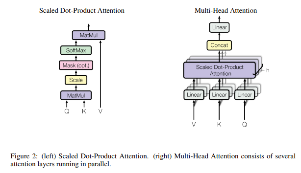
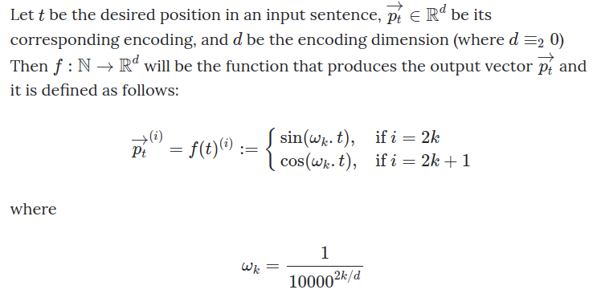
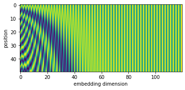

```python
import torch
import torch.nn as nn
import numpy as np
import math
import collections
import copy
import matplotlib.pyplot as plt
```

***
### TRANSFORMER ENCODER-DECODER IMPLEMENTATION FROM SCRATCH ON THE MACHINE TRANSLATION PROBLEM
***

### *DATA*

Source : http://www.manythings.org/anki/

In the file **"en_fra.txt"** each line is an example and can be broken down as follows:

ENGLISH_PART \t FRENCH_PART \t REFERENCES_PART


```python
with open("../data/en_fra.txt") as f:
    examples = f.readlines();
```


```python
examples[0]
```


    'Go.\tVa !\tCC-BY 2.0 (France) Attribution: tatoeba.org #2877272 (CM) & #1158250 (Wittydev)\n'


```python
def standardizeString(string, is_string_target):

    space_characters = ['\u202f', '\u2009','\xa0'];
    special_characters = '«»"-.,;:!?';
    numbers = '0123456789';
    
    ## Remove space characters
    for i in range(len(space_characters)):
        if space_characters[i] in string:
            string = string.replace(space_characters[i], ' ');
        
    len_string, _string = len(string), '';
    for i, char in enumerate(string):
        
        ## Handle special characters
        if char in special_characters:
            left_space, right_space = '', '';
            
            if i > 0 and string[i-1] != ' ':
                left_space = ' ';

            if i+1 < len_string and string[i+1] != ' ' and string[i+1] not in special_characters:
                right_space = ' ';
            
            _string += left_space + char + right_space;

        ## Handle hours
        elif char == 'h':
            left_space, right_space = '', '';
            
            if i > 0 and string[i-1] in numbers:
                left_space = ' ';
            
            if i+1 < len_string and string[i+1] in numbers:
                right_space = ' ';
                
            _string += left_space + char + right_space;         
                
        else:
            _string += char;

    
    _string = _string.lower() + ' <eos>';
    
    return '<bos> ' + _string if is_string_target else _string;
```


```python
en_examples, fr_examples = [], [];

for i in range(len(examples)):
    exi = examples[i][0:examples[i].find('CC-BY 2.0')];

    exi = exi.split('\t');

    en_examples.append(standardizeString(exi[0], False).split(' '));
    fr_examples.append(standardizeString(exi[1], True).split(' '));
```


```python
print(examples[87620][0:examples[87620].find('CC-BY 2.0')]);
print('--------');
print('EN => ',en_examples[87620]);
print('FR => ',fr_examples[87620]);
```

    I've got a meeting at 2:30.	J'ai une réunion à 2h30.	
    --------
    EN =>  ["i've", 'got', 'a', 'meeting', 'at', '2', ':', '30', '.', '<eos>']
    FR =>  ['<bos>', "j'ai", 'une', 'réunion', 'à', '2', 'h', '30', '.', '<eos>']


```python
print(examples[91613][0:examples[91613].find('CC-BY 2.0')]);
print('--------');
print('EN => ',en_examples[91613]);
print('FR => ',fr_examples[91613]);
```

    "More coffee?" "No, thanks."	«Davantage de café ?» «Non, c'est bon.»	
    --------
    EN =>  ['"', 'more', 'coffee', '?', '"', '"', 'no', ',', 'thanks', '.', '"', '<eos>']
    FR =>  ['<bos>', '«', 'davantage', 'de', 'café', '?', '»', '«', 'non', ',', "c'est", 'bon', '.', '»', '<eos>']


***
### *VOCAB*


```python
class Vocab:
    def __init__(self, dataset2d):
        self.token_to_idx = {};
        self.idx_to_token = [];
        self.initVocab(dataset2d);
        
    def initVocab(self, dataset2d):
        token_freq = collections.Counter(
            [dataset2d[i][j] for i in range(len(dataset2d)) for j in range(len(dataset2d[i]))]);
        token_freq = token_freq.most_common();
        
        for i in range(len(token_freq)):
            self.token_to_idx[token_freq[i][0]] = i;
            self.idx_to_token.append(token_freq[i][0]);
    
    def tokenToIdx(self, dataset2d):
        for i in range(len(dataset2d)):
            for j in range(len(dataset2d[i])):
                dataset2d[i][j] = self.token_to_idx[dataset2d[i][j]];
        return torch.tensor(dataset2d);
                
    def idxToToken(self, dataset2d):
        dataset2d = dataset2d.tolist();
        
        for i in range(len(dataset2d)):
            for j in range(len(dataset2d[i])):
                dataset2d[i][j] = self.idx_to_token[dataset2d[i][j]];
        return dataset2d;
    
    def __len__(self):
        return len(self.idx_to_token);
```

***
### *DATASETS TRAIN/TEST AND THEIR RESPECTIVE VOCABULARY*


```python
def datasets(source_examples, target_examples, dataset_train_size, dataset_test_size, 
             batch_size_train, batch_size_test):
    
    source_examples = copy.deepcopy(source_examples);
    target_examples = copy.deepcopy(target_examples);
    
    ## The document "en_fra.txt" provides examples in ascending order of the number of tokens.
    ## So before delineating my training/test datasets, randomize the order of the examples,
    ## in order to maximize the heterogeneity in both.
    random_indexation = torch.randperm(dataset_train_size + dataset_test_size);
    
    source_examples = source_examples[0:dataset_train_size+dataset_test_size];
    source_examples = [source_examples[random_indexation[i]] for i in range(len(random_indexation))];
    target_examples = target_examples[0:dataset_train_size+dataset_test_size];
    target_examples = [target_examples[random_indexation[i]] for i in range(len(random_indexation))];
    
    ## source_seq_len[i] = the number of tokens of sequence i (before padding).
    ## The importance of these quantities lies in the calculation of the context variable C in the encoder.
    source_seq_len = sequencesLen(source_examples);
    source_seq_len_train = source_seq_len[0:dataset_train_size];
    source_seq_len_test = source_seq_len[dataset_train_size:dataset_train_size+dataset_test_size];
    
    source_examples = padding(source_examples);
    target_examples = padding(target_examples);

    source_vocab = Vocab(source_examples);
    source_examples = source_vocab.tokenToIdx(source_examples);
    target_vocab = Vocab(target_examples);
    target_examples = target_vocab.tokenToIdx(target_examples);

    ds_src_train = source_examples[0:dataset_train_size];
    ds_trg_train_in = target_examples[0:dataset_train_size][:,:-1];
    ds_trg_train_out = target_examples[0:dataset_train_size][:,1:];
    datasets_train = dataLoader(batch_size_train, True, ds_src_train, source_seq_len_train, 
                                ds_trg_train_in, ds_trg_train_out); 
    
    ds_src_test = source_examples[dataset_train_size:dataset_train_size+dataset_test_size];
    ds_trg_test_out = target_examples[dataset_train_size:dataset_train_size+dataset_test_size][:,1:];
    datasets_test = dataLoader(batch_size_test, False, ds_src_test, source_seq_len_test, ds_trg_test_out);
    
    return datasets_train, datasets_test, source_vocab, target_vocab;
```


```python
def dataLoader(batch_size, shuffle, *tensors):
    TD = torch.utils.data.TensorDataset(*tensors);
    return torch.utils.data.DataLoader(TD, batch_size, shuffle);
```


```python
## Determine the longest sequence among dataset_examples 
## and complete the other sequences with the <pad> token so that their length matches the longest.

def padding(dataset_examples):
    
    max_length = 0;

    def maxLength(dataset, max_length):
        for i in range(len(dataset)):
            if len(dataset[i]) > max_length:
                max_length = len(dataset[i]);
        return max_length;
                
    max_length = maxLength(dataset_examples, max_length);
    
    def pad(dataset, max_length):
        for i in range(len(dataset)):
            if len(dataset[i]) < max_length:
                dataset[i] += ['<pad>']*(max_length-len(dataset[i]));
        return dataset;
    
    dataset_examples = pad(dataset_examples, max_length);
                
    return dataset_examples;
```


```python
def sequencesLen(dataset_examples):
    
    sequences_len = [];
    
    for i in range(len(dataset_examples)):
        sequences_len.append(len(dataset_examples[i]));
        
    return torch.tensor(sequences_len);
```


```python
dataset_train_size = 750;
dataset_test_size = 50;
batch_size_train = 750;
batch_size_test = 10;

datasets_train, datasets_test, source_vocab, target_vocab = datasets(en_examples, 
                                                                     fr_examples, 
                                                                     dataset_train_size, 
                                                                     dataset_test_size, 
                                                                     batch_size_train, 
                                                                     batch_size_test);
```


```python
len(source_vocab), len(target_vocab)
```


    (249, 578)


***
### *ATTENTION*

***
Note: The implementation of Multi-Head Attention below follows the implementation of the paper "Attention Is All You Need" while the schema in the notebook MultiHeadAttention_ch11 follows the implementation of the book "Dive Into Deep Learning".

*In the first case* : 
Queries, Keys and Values are multiplied by a weight matrix WQi, WKi, WVi, respectively in the case of the ith head. (See image below for more details)

*In the second case*:
Queries, Keys and Values are multiplied by a weight matrix WQ, WK, WV, respectively. Following this transformation, Queries, Keys and Values will each be split into several parts (the same number of parts: **num_heads**), along the last dimension (dim=-1). The ith part of Queries, the ith part of Keys and the ith part of Values will form the ith head (see MultiHeadAttention_ch11)
***

 

"Multi-head attention allows the model to jointly attend to information from different representation
subspaces at different positions. With a single attention head, averaging inhibits this." - page 5.

source : https://arxiv.org/abs/1706.03762?context=cs


```python
class MultiHeadAttention(nn.Module):
    def __init__(self, num_heads, dk, dv, dmodel):
        super().__init__();
        
        self.num_heads = num_heads;
        self.dk = dk;
        
        self.weights_params = [];
        for i in range(num_heads):
            WQi = nn.Linear(dmodel,dk);
            WKi = nn.Linear(dmodel,dk);
            WVi = nn.Linear(dmodel,dv);
            
            self.weights_params.append([WQi,WKi,WVi]);
            
        self.WO = nn.Linear(num_heads*dv,dmodel);
    
    def forward(self, queries, keys, values, source_seq_len=None, mask=False):
        # (queries|keys|values).shape = (batch_size, num_steps, dmodel)
        
        heads = [];
        
        for i in range(self.num_heads):
            WQi, WKi, WVi = self.weights_params[i];
            
            # ith head shape = (batch_size, num_steps, dv)
            heads.append(
                scaledDotProductAttention(WQi(queries), WKi(keys), WVi(values), self.dk, source_seq_len, mask));
        
        # heads.shape = (batch_size, num_steps, num_heads*dv)
        heads = torch.cat(heads, dim=-1);
        
        return self.WO(heads);
```


```python
def scaledDotProductAttention(Q, K, V, dk, source_seq_len, mask):
    QK = torch.bmm(Q,K.transpose(1,2)) / math.sqrt(dk);
    
    return torch.bmm(maskedSoftmax(QK, source_seq_len, mask), V);
```


```python
def maskedSoftmax(QK, source_seq_len, mask):
    # QK.shape = (batch_size, num_steps, num_steps)
    
    QK_shape = QK.shape;
    
    if mask is True:
        mask_to_apply = ~(torch.arange(0,QK_shape[1])[None,:] < torch.arange(1,QK_shape[1]+1)[:,None]);
        mask_to_apply = mask_to_apply.unsqueeze(dim=0).repeat(QK_shape[0],1,1);
        
        QK[mask_to_apply] = -1e6;
    
    if source_seq_len is not None:
        steps = torch.arange(1, QK_shape[1]+1).unsqueeze(dim=0).repeat(QK_shape[1],1).unsqueeze(dim=0).repeat(QK_shape[0], 1, 1);
        valid_len = source_seq_len.unsqueeze(dim=1).unsqueeze(dim=1).repeat_interleave(repeats=QK_shape[1], dim=1);
        padding_mask = steps > valid_len;
        
        QK[padding_mask] = -1e6;
    
    return nn.functional.softmax(QK, dim=-1);
```

***
### *POSITION-WISE FEED FORWARD NETWORKS*


```python
class FFN(nn.Module):
    def __init__(self, dmodel, dff):
        super().__init__();
        
        self.W1 = nn.Linear(dmodel,dff);
        self.W2 = nn.Linear(dff,dmodel);
        self.relu = nn.ReLU();
        
    def forward(self, X):
        # X.shape = (batch_size, num_steps, dmodel)
        
        return self.W2(self.relu(self.W1(X)));
```

***
### *RESIDUALS*

"And so what has happened was these residuals were carrying position information to every layer." - Ashish Vaswani

source : https://www.youtube.com/watch?v=5vcj8kSwBCY&t=1110s [Importance of Residuals (19:30 - 20:45)]


```python
class AddandNorm(nn.Module):
    def __init__(self, dmodel, dropout=0):
        super().__init__();
        
        self.LN = nn.LayerNorm(dmodel);
        self.dropout = nn.Dropout(dropout);
    
    def forward(self, X, Y):
        # (X|Y).shape = (batch_size, num_steps, dmodel)

        return self.LN(X + self.dropout(Y));
```

***
### *POSITIONAL ENCODING*



source : https://kazemnejad.com/blog/transformer_architecture_positional_encoding/


```python
class PositionalEncoding(nn.Module):
    def __init__(self, dmodel, dropout, max_seq_len=1000):
        super().__init__();
        
        # It is possible that dmodel is odd but this makes the code more complex without adding value.
        assert dmodel % 2 == 0, "dmodel must be even";
        
        self.dropout = nn.Dropout();
        
        # t.shape = (max_seq_len, dmodel/2)
        t = torch.arange(0,max_seq_len).unsqueeze(dim=1).repeat_interleave(repeats=int(dmodel/2),dim=1);
        # w.shape = (max_seq_len, dmodel/2)
        wk = 1/torch.pow(10000, torch.arange(0,dmodel,step=2)/dmodel).unsqueeze(dim=0);
        wk = wk.repeat_interleave(repeats=max_seq_len,dim=0);
        
        # pos_encoding.shape = (max_seq_len, dmodel)
        self.pos_encoding = torch.zeros(max_seq_len, dmodel);
        self.pos_encoding[:,0::2] = torch.sin(wk*t);
        self.pos_encoding[:,1::2] = torch.cos(wk*t);

    def forward(self, X):
        # X.shape = (batch_size, num_steps, dmodel)
        X_shape = X.shape;
        
        pos_encoding = self.pos_encoding[:X_shape[1],:].unsqueeze(dim=0).repeat(X.shape[0],1,1);
        
        return self.dropout(pos_encoding + X);
```


```python
pe = PositionalEncoding(dmodel=120,dropout=0,max_seq_len=50).pos_encoding;
plt.imshow(pe);
plt.xlabel("embedding dimension");
plt.ylabel("position");
plt.show();
```


    

    


***
### *ENCODER-DECODER MODEL*

Note: 
In the "def datasets" function, I call the "def padding" function for sources_examples and target_examples independently, and what results is that "num_steps" can vary in src_X (built on sources_examples) versus bos_X (built on target_examples).

**ENCODER**


```python
class EncoderBlock(nn.Module):
    def __init__(self, num_heads, dmodel, dk, dv, dff, dropout):
        super().__init__();
        
        self.MHA = MultiHeadAttention(num_heads, dk, dv, dmodel);
        self.AAN = AddandNorm(dmodel, dropout);
        self.FFN = FFN(dmodel, dff);

    def forward(self, X, source_seq_len):
        # sli_out.shape = (batch_size, number of steps in src_X, dmodel)
        # sli stands for the ith sublayer of the encoder block.
        
        sl1_out = self.MHA(X, X, X, source_seq_len);
        sl1_out = self.AAN(X, sl1_out);
        
        sl2_out = self.FFN(sl1_out)
        sl2_out = self.AAN(sl1_out, sl2_out);
        
        return sl2_out;
```


```python
class Encoder(nn.Module):
    def __init__(self, num_blocks, vocab_size, num_heads, dmodel, dk, dv, dff, dropout, max_seq_len=1000):
        super().__init__();
        
        self.num_blocks = num_blocks;
        self.embedding = nn.Embedding(vocab_size, dmodel);
        self.pencoding = PositionalEncoding(dmodel, dropout, max_seq_len);
        
        self.encoder_blocks = [];
        for i in range(num_blocks):
            self.encoder_blocks.append(EncoderBlock(num_heads, dmodel, dk, dv, dff, dropout));

    def forward(self, src_X, source_seq_len_train):
        # X.shape = (batch_size, number of steps in src_X, dmodel)
        X = self.pencoding(self.embedding(src_X));
            
        for i in range(self.num_blocks):
            X = self.encoder_blocks[i](X, source_seq_len_train);
            
        return X;
```

**DECODER**


```python
class DecoderBlock(nn.Module):
    def __init__(self, num_heads, dmodel, dk, dv, dff, dropout):
        super().__init__();
        
        self.MHA1 = MultiHeadAttention(num_heads, dk, dv, dmodel);
        self.MHA2 = MultiHeadAttention(num_heads, dk, dv, dmodel);
        self.AAN = AddandNorm(dmodel, dropout);
        self.FFN = FFN(dmodel, dff);
        
    def forward(self, X, enc_output, mask=False):
        # X.shape = (batch_size, number of steps in bos_X, dmodel)
        # enc_output.shape = (batch_size, number of steps in src_X, dmodel)
        
        # sli_out.shape = (batch_size, number of steps in bos_X, dmodel)
        # sli stands for the ith sublayer of the decoder block.
        
        sl1_out = self.MHA1(X, X, X, None, mask);
        sl1_out = self.AAN(X, sl1_out);
        
        sl2_out = self.MHA2(sl1_out, enc_output, enc_output);
        sl2_out = self.AAN(sl1_out, sl2_out);
        
        sl3_out = self.FFN(sl2_out);
        sl3_out = self.AAN(sl2_out, sl3_out);
        
        return sl3_out; 
```


```python
class Decoder(nn.Module):
    def __init__(self, num_blocks, vocab_size, num_heads, dmodel, dk, dv, dff, dropout, max_seq_len=1000):
        super().__init__();
        
        self.num_blocks = num_blocks;
        self.embedding = nn.Embedding(vocab_size, dmodel);
        self.pencoding = PositionalEncoding(dmodel, dropout, max_seq_len);
        
        self.W_out = nn.Linear(dmodel, vocab_size);
        
        self.decoder_blocks = [];
        for i in range(num_blocks):
            self.decoder_blocks.append(DecoderBlock(num_heads, dmodel, dk, dv, dff, dropout));
        
    def forward(self, bos_X, enc_output):
        
        # X.shape = (batch_size, number of steps in bos_X, dmodel)
        X = self.pencoding(self.embedding(bos_X));
        
        mask = True if self.training else False;
        
        for i in range(self.num_blocks):
            X = self.decoder_blocks[i](X, enc_output, mask);
            
        return self.W_out(X);
```

**ENCODER-DECODER**


```python
class EncoderDecoder(nn.Module):
    def __init__(self, encoder, decoder):
        super().__init__();
        self.encoder = encoder;
        self.decoder = decoder;
        
    def forward(self, src_X, bos_X, source_seq_len):
        # src_X.shape = (batch_size, number of steps in src_X)
        # bos_X.shape = (batch_size, number of steps in bos_X)
        
        enc_output = self.encoder(src_X, source_seq_len);
        Y_hat = self.decoder(bos_X, enc_output);
        
        return Y_hat;
```


```python
# ENCODER PARAMETERS
source_vocab_size = len(source_vocab);

# DECODER PARAMETERS
target_vocab_size = len(target_vocab);

# SHARED PARAMETERS
num_blocks = 2;
num_heads = 10;
dmodel, dk, dv, dff = 128, 32, 32, 64;
dropout = 0.1;

encoder = Encoder(num_blocks, source_vocab_size, num_heads, dmodel, dk, dv, dff, dropout);
decoder = Decoder(num_blocks, target_vocab_size, num_heads, dmodel, dk, dv, dff, dropout);
model = EncoderDecoder(encoder, decoder);
```


```python
def loadModel(model, load_model=False):
    if load_model:
        model.load_state_dict(torch.load('../data/lstm_parameters_Transformer_ch11.pt'));
```


```python
loadModel(model, False);
```

***
### *LOSS*


```python
pad_idx = target_vocab.token_to_idx['<pad>'];
pad_idx
```


    0


```python
CEL = nn.CrossEntropyLoss();
```


```python
def loss(Y_hat, Y, pad_idx):

    Y_hat = Y_hat.reshape(-1, Y_hat.shape[-1]);
    Y = Y.flatten();
    
    is_not_pad = Y != pad_idx;
    
    Y_hat = Y_hat[is_not_pad];
    Y = Y[is_not_pad];

    return CEL(Y_hat, Y);
```

***
### *OPTIMIZER*


```python
optimizer = torch.optim.Adam(model.parameters(), lr=0.03);
```

***
### *TRAINING*


```python
def train(model,datasets,loss,optimizer,num_epochs,save_params=False):
    
    model.train();
    for epoch in range(num_epochs):
        for src_X, source_seq_len_train, bos_X, Y in datasets:
            
            l = loss(model(src_X, bos_X, source_seq_len_train), Y, pad_idx);

            with torch.no_grad():
                l.backward();
                optimizer.step();
                optimizer.zero_grad();
        
        print(f'Epoch {epoch} - Training loss {l}');
    
    if save_params:
        torch.save(model.state_dict(), '../data/lstm_parameters_Transformer_ch11.pt');
```


```python
train(model, datasets_train, loss, optimizer, 200, False);
```

    Epoch 0 - Training loss 0.9196598529815674
    Epoch 1 - Training loss 0.920103907585144
    Epoch 2 - Training loss 0.8229804635047913
    Epoch 3 - Training loss 0.8291837573051453
    ...
    Epoch 196 - Training loss 0.6078591346740723
    Epoch 197 - Training loss 0.5785852670669556
    Epoch 198 - Training loss 0.5865816473960876
    Epoch 199 - Training loss 0.5819040536880493


***
### *PREDICTION*


```python
bos_idx = target_vocab.token_to_idx['<bos>'];
bos_idx
```


    1


```python
eos_idx = target_vocab.token_to_idx['<eos>'];
eos_idx
```


    2


```python
def prediction(model,datasets,bos_idx,eos_idx,source_vocab,target_vocab):
    
    preds_outputs_src = [];
    preds_outputs_y = [];
    
    src_X, source_seq_len_test, Y = next(iter(datasets_test));    
    bos_X = torch.empty((len(src_X),1)).fill_(bos_idx).type(torch.int32);
    
    while(len(src_X) > 0):

        Y_hat = torch.transpose(model(src_X, bos_X, source_seq_len_test),0,1)[-1];
        preds = torch.argmax(Y_hat,dim=-1,keepdim=True);

        bos_X = torch.cat((bos_X,preds),dim=-1);

        ## Halt prediction if <eos> token.
        preds_is_eos = (preds == eos_idx).flatten();

        src_X_halt = source_vocab.idxToToken(src_X[preds_is_eos]);
        for i in range(len(src_X_halt)):
            preds_outputs_src.append(src_X_halt[i]);

        bos_X_halt = target_vocab.idxToToken(bos_X[preds_is_eos]);
        for i in range(len(bos_X_halt)):
            preds_outputs_y.append(bos_X_halt[i]);

        ## Delete terminated predictions.
        src_X = src_X[~preds_is_eos];
        bos_X = bos_X[~preds_is_eos];
        source_seq_len_test = source_seq_len_test[~preds_is_eos];
         
    return preds_outputs_src, preds_outputs_y;
```


```python
out_src, out_y = prediction(model,datasets_test,bos_idx,eos_idx, source_vocab, target_vocab);
```


```python
for x, y in zip(out_src, out_y):
    print("src => ", x);
    print("pred => ", y);
    print("******");
```

    src =>  ['go', 'ahead', '!', '<eos>', '<pad>']
    pred =>  ['<bos>', 'allez', '!', '<eos>']
    ******
    src =>  ['shut', 'up', '!', '<eos>', '<pad>']
    pred =>  ['<bos>', 'ferme', '!', '<eos>']
    ******
    src =>  ['i', 'swore', '.', '<eos>', '<pad>']
    pred =>  ['<bos>', 'j’ai', 'juré', '.', '<eos>']
    ******
    src =>  ['relax', '.', '<eos>', '<pad>', '<pad>']
    pred =>  ['<bos>', 'du', 'calme', '.', '<eos>']
    ******
    src =>  ["it's", 'me', '!', '<eos>', '<pad>']
    pred =>  ['<bos>', "c'est", 'génial', '!', '<eos>']
    ******
    src =>  ['be', 'fair', '.', '<eos>', '<pad>']
    pred =>  ['<bos>', 'sois', 'honnête', '.', '<eos>']
    ******
    src =>  ['i', 'see', '.', '<eos>', '<pad>']
    pred =>  ['<bos>', 'je', 'comprends', '.', '<eos>']
    ******
    src =>  ['i', 'nodded', '.', '<eos>', '<pad>']
    pred =>  ['<bos>', 'je', 'te', 'remercie', '.', '<eos>']
    ******
    src =>  ['kill', 'it', '.', '<eos>', '<pad>']
    pred =>  ['<bos>', 'tue', '-', 'la', '.', '<eos>']
    ******
    src =>  ["i'm", 'well', '.', '<eos>', '<pad>']
    pred =>  ['<bos>', 'je', 'vais', 'bien', '.', '<eos>']
    ******

